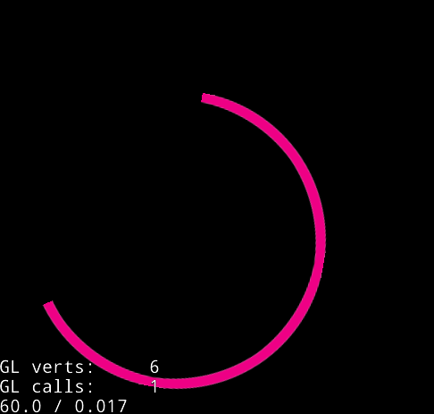

Circular and Progress bar Implementation
==========================================

###Cocos2d-x C++

Cocos2d-x is a popular game engine for mobile devices. It has over 400,000 developers world wide, and games made with Cocos2d-x dominates top charts for iOS and Android. For more details, please visit [Cocos2d-x official website](http://www.cocos2d-x.org/).

###Circular bar ?

	

### Progress Bar ?
	

* Complie and Run.
